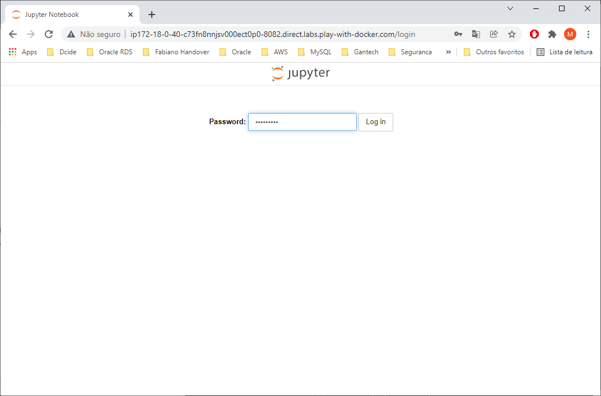
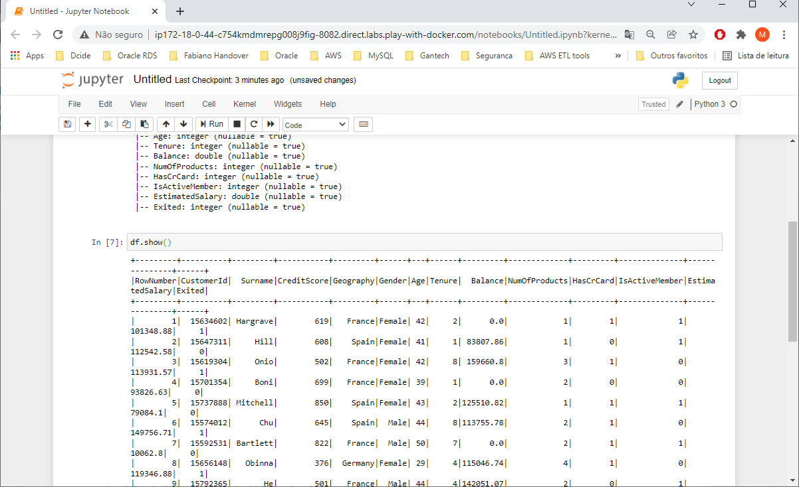

# Jupyter client running into Standalone cluster in Docker

Apache Spark is an open-source, distributed processing system used for big data workloads.

In this demo, a Spark container uses a Spark Standalone cluster as a resource management and job scheduling technology to perform distributed data processing.

This Docker image contains Spark binaries prebuilt and uploaded in Docker Hub.

## Build Jupyter/Spark image
```shell
$ git clone https://github.com/mkenjis/apache_binaries
$ wget https://archive.apache.org/dist/spark/spark-3.0.3/spark-3.0.3-bin-hadoop2.7.tgz
$ docker image build -t mkenjis/ubpyspk_img
$ docker login   # provide user and password
$ docker image push mkenjis/ubpyspk_img
```

## Shell Scripts Inside 

> run_spark.sh

Sets up the environment for Spark client by executing the following steps :
- sets environment variables for JAVA and SPARK
- starts the SSH service for passwordless SSH files on start-up

> create_conf_files.sh

Creates the following Hadoop files on $SPARK_HOME/conf directory :
- spark-env.sh

## Start Swarm cluster

1. start swarm mode in node1
```shell
$ docker swarm init --advertise-addr <IP node1>
$ docker swarm join-token worker  # issue a token to add a node as worker to swarm
```

2. add 3 more workers in swarm cluster (node2, node3, node4)
```shell
$ docker swarm join --token <token> <IP node1>:2377
```

3. label each node to anchor each container in swarm cluster
```shell
docker node update --label-add hostlabel=hdpmst node1
docker node update --label-add hostlabel=hdp1 node2
docker node update --label-add hostlabel=hdp2 node3
docker node update --label-add hostlabel=hdp3 node4
```

4. create an external "overlay" network in swarm to link the 2 stacks (hdp and spk)
```shell
docker network create --driver overlay mynet
```

5. start the Hadoop cluster (with HDFS and YARN)
```shell
$ docker stack deploy -c docker-compose-hdp.yml hdp
$ docker stack ps hdp
jeti90luyqrb   hdp_hdp1.1     mkenjis/ubhdpclu_vol_img:latest   node2     Running         Preparing 39 seconds ago             
tosjcz96hnj9   hdp_hdp2.1     mkenjis/ubhdpclu_vol_img:latest   node3     Running         Preparing 38 seconds ago             
t2ooig7fbt9y   hdp_hdp3.1     mkenjis/ubhdpclu_vol_img:latest   node4     Running         Preparing 39 seconds ago             
wym7psnwca4n   hdp_hdpmst.1   mkenjis/ubhdpclu_vol_img:latest   node1     Running         Preparing 39 seconds ago
```

6. start a spark standalone cluster and spark client
```shell
$ docker stack deploy -c docker-compose.yml spk
$ docker service ls
ID             NAME           MODE         REPLICAS   IMAGE                             PORTS
t3s7ud9u21hr   spk_spk_mst    replicated   1/1        mkenjis/ubpyspk_img:latest   
mi3w7xvf9vyt   spk_spk1   replicated   1/1        mkenjis/ubpyspk_img:latest   
xlg5ww9q0v6j   spk_spk2   replicated   1/1        mkenjis/ubpyspk_img:latest   
ni5xrb60u71i   spk_spk3   replicated   1/1        mkenjis/ubpyspk_img:latest
```

7. access spark master node
```shell
$ docker container ls   # run it in each node and check which <container ID> is running the Spark master constainer
CONTAINER ID   IMAGE                         COMMAND                  CREATED              STATUS              PORTS      NAMES
71717fcd5a01   mkenjis/ubpyspk_img:latest   "/usr/bin/supervisord"   14 minutes ago   Up 14 minutes   4040/tcp, 7077/tcp, 8080-8082/tcp, 10000/tcp   spark_spk2.1.bf8tsqv5lyfa4h5i8utwvtpch
464730a41833   mkenjis/ubpyspk_img:latest   "/usr/bin/supervisord"   14 minutes ago   Up 14 minutes   4040/tcp, 7077/tcp, 8080-8082/tcp, 10000/tcp   spark_spk_mst.1.n01a49esutmbgv5uum3tdsm6p

$ docker container exec -it <spk_mst ID> bash
```

8. run jupyter notebook --generate-config
```shell
$ jupyter notebook --generate-config
```

9. edit /root/.jupyter/jupyter_notebook_config.py
```shell
$ vi /root/.jupyter/jupyter_notebook_config.py
c.NotebookApp.ip = '*'
c.NotebookApp.open_browser = False
c.NotebookApp.port = 8082
```

10. setup a jupyter password
```shell
$ jupyter notebook password
Enter password:  *********
Verify password: *********
```

11. run pyspark
```shell
PYSPARK_DRIVER_PYTHON_OPTS="notebook --no-browser --allow-root --port=8082" pyspark --master spark://<hostname>:7077
```

12. in the browser, issue the address https://host:8082 to access the Jupyter Notebook.

Provide the credentials previously created



Click on New button to start a new notebook. Choose Python3 as interpreter


Issue Spark commands


